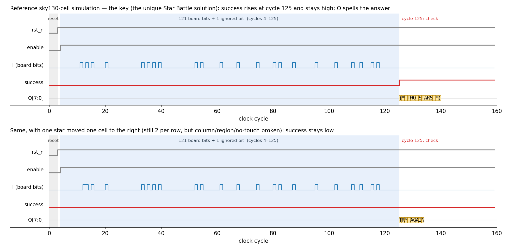
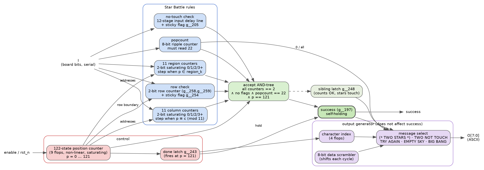
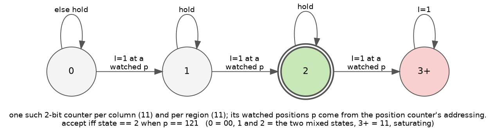
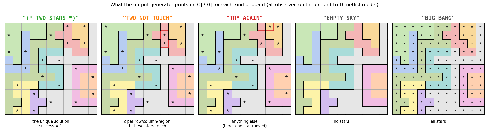
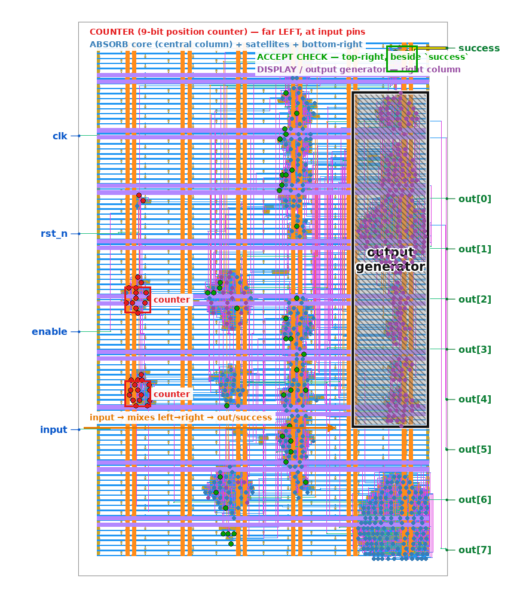
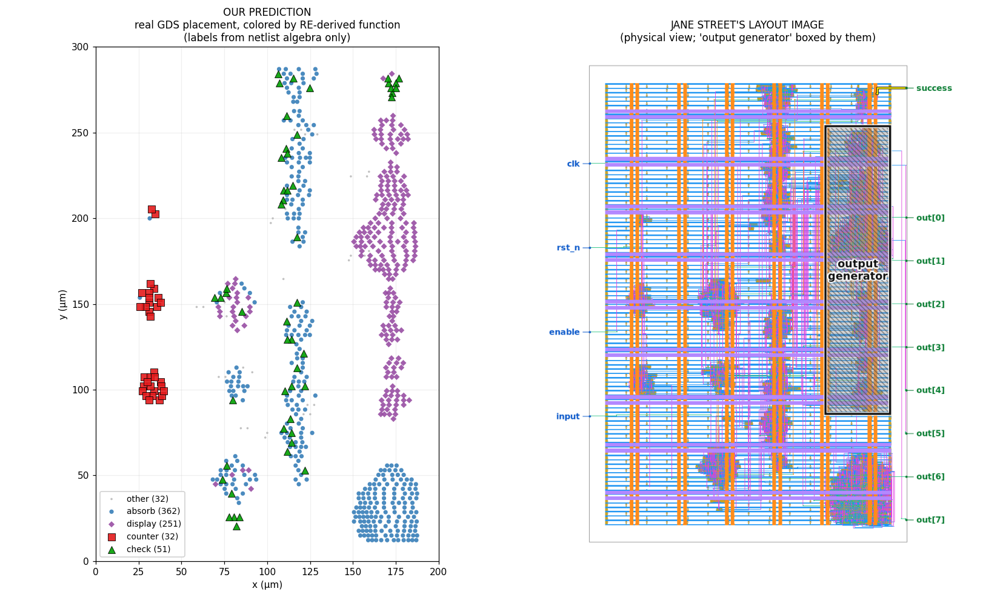
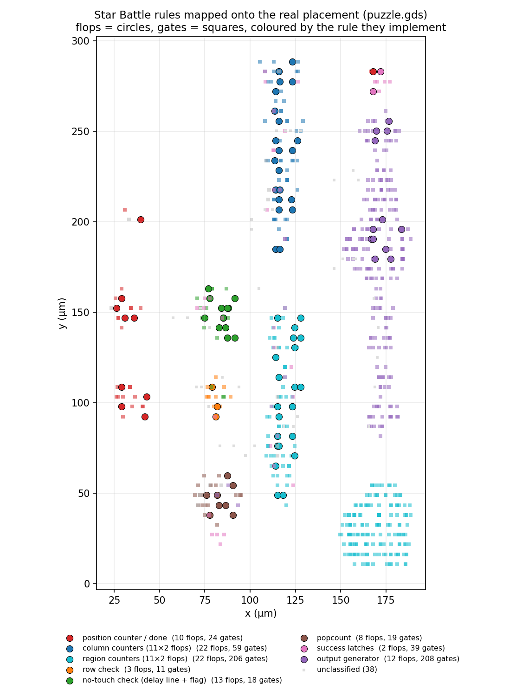
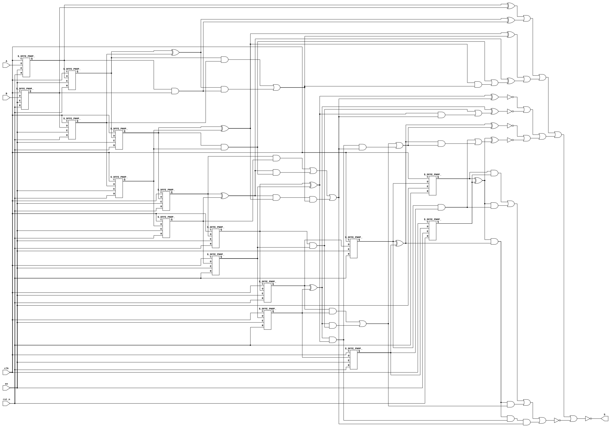

# ASIC Reverse-Engineering Puzzle

This repository provides the files for the Jane Street ASIC reverse-engineering puzzle! See the [blog post](https://blog.janestreet.com/can-you-reverse-engineer-an-asic/) for more details.

### Puzzle GDS

The puzzle GDS is in this repository, in the file named `puzzle.gds`. You can preview it using [KLayout](https://www.klayout.de/) or the [TinyTapeout Online GDS Viewer](https://gds-viewer.tinytapeout.com/).

See `example_inputs.vcd` which shows some inputs being fed to the design (unfortunately, not the correct inputs to make `success` go high!). You can view it using [Surfer](https://surfer-project.org/) or a similar tool.

To help you get started, below is an image with some hints. The region labelled as "output generator" is safe to ignore during your initial reverse-engineering steps, but you'll need to simulate it to get your final answer!


### Warm-up Puzzle

To familiarize yourself with the flow and help develop your tools, we've put together a small example design and run it through a very similar flow to the one used for the real thing! The example design consists of two shift registers, an adder, and a comparator, outputting success if `A + B == 496`.

You'll find the following files related to the warm-up puzzle:

- `warmup/00_source.v`: The original Verilog source code of the example design
- `warmup/01_netlist.v`: Synthesized netlist comprising of a list of standard cells
  and connections
- `warmup/02_netlist_with_power_rails.v`: Netlist with VDD and GND rails added
- `warmup/03_post_place_and_route.def`: Physical layout of cells and routing
  connections, corresponding to cell and net names.
- `warmup/04_final.gds`: The final manufacturable layout file, with many internal names
  removed

---

# SKR solution

> **Answer: `TWO STARS`** — the chip prints `(* TWO STARS *)` (an OCaml comment) when unlocked.
> **What the chip is:** a serial **two-star Star Battle verifier**. It consumes an 11×11 board (121 cells,
> row-major, `1` = star), checks *exactly two stars per row, per column and per region — no two touching* —
> against a region layout hidden in the logic, and unlocks only for that puzzle's **one and only solution**.


*Reference sky130-cell simulation. Top: the key — `success` rises at cycle 125 (the cycle after the last board bit) and
stays high while `O` spells `(* TWO STARS *)`. Bottom: the same board with one star moved one cell — `TRY AGAIN`.*

All work lives in [`SKR_solution/`](SKR_solution/). Nothing outside it was modified. The submission writeup
is written by hand (per the rules); the documents below are the working notes it draws on.

## Table of contents
- [Results at a glance](#results-at-a-glance)
- [Task 1 — GDS → netlist](#task-1--gds--netlist)
- [Task 2a — what the chip does](#task-2a--what-the-chip-does)
- [Task 2b — the key and the answer](#task-2b--the-key-and-the-answer)
- [Verification status (stated precisely)](#verification-status-stated-precisely)
- [Images](#images)
- [Tools used](#tools-used)
- [Writeups & documents](#writeups--documents)
- [Easter eggs](#easter-eggs)
- [Directory map](#directory-map)

## Results at a glance

| item | result |
|---|---|
| netlist | `extract/puzzle/extracted_puzzle.v` — 728 sky130 cells, 92 flip-flops, validated six ways |
| purpose | 2★ Star Battle checker, 11×11, 11 regions (map recovered from the silicon) |
| key | 121-cell board = the puzzle's unique solution (`debug_S1/SOLUTION_key_bits.txt`, 122 bits, last bit ignored) |
| protocol | `rst_n=0` for 3 cycles, 1 idle cycle, then `enable=1` and one board bit per clock, MSB (cell 0) first |
| output | `success` high from cycle 125 (self-holding); `O[7:0]` spells `(* TWO STARS *)` |
| other messages | `TRY AGAIN` · `TWO NOT TOUCH` (all counts right, stars touch) · `EMPTY SKY` (no stars) · `BIG BANG` (all stars) |
| solutions | exactly **1** with the recovered regions (31,197,434 boards satisfy rows/columns/no-touch alone) |

## Task 1 — GDS → netlist

Built a KLayout `LayoutToNetlist` extractor ([`extract/extract.py`](SKR_solution/extract/extract.py)) that turns
`puzzle.gds` into a sky130 gate netlist. Trust was established the way a formal person would want it — proof, not
inspection ([`SKR_challenge.md`](SKR_solution/SKR_challenge.md), "Extraction trust"):

1. **Calibrate on ground truth** — extracted `warmup/04_final.gds`, proved EQY-equivalent to the golden `01_netlist.v`.
2. **Negative control** — planted a misrouted D input → EQY fails with a counterexample.
3. **Independent methods** — KLayout L2N, **Magic** and **HAL** agree on 728 cells / 92 FFs / I/O.
4. **Adjudicate disagreements at the geometry** — one disputed net (`$1447`) settled by measuring the GDS polygons.
5. **Invariants** — cell histogram = GDS, no dangling/undriven/shorted nets, no combinational loops, ports = pads.
6. **Golden trace** — replaying `example_inputs.vcd` through netlist + sky130 models reproduces `TRY AGAIN` ×2, `success=0`,
   byte-for-byte ([`behavior_check/`](SKR_solution/behavior_check/)).

## Task 2a — what the chip does

Peeled in layers, each one correcting the last (the netlist always won):

| layer | method | finding |
|---|---|---|
| structure | HAL DANA, dependency graph (801 edges) | one entangled 92-bit state, deliberately scrambled |
| linearity | Δ-input superposition sim | non-linear state fold; separable linear display |
| exact recurrence | symbolic ANF from netlist + Liberty ([`hash/anf/`](SKR_solution/hash/anf/)) | literal next-state equation of all 92 flops |
| control | brute-force of the counter ANF | 9 flops = a 122-state saturating **position counter** |
| datapath | yosys SAT miter ([`recon/opam/comb_miter.log`](SKR_solution/recon/opam/comb_miter.log)) | 90 next-state functions **formally ≡ netlist** |
| accept check | literal readout of the cone | 56 literals + self-hold; includes an 8-bit **popcount = 22** |
| the twist | enumerate the 22 accept-check flop pairs ([`recon/opam/automata.py`](SKR_solution/recon/opam/automata.py)) | each is an **independent 2-bit counter** stepped at counter-selected positions — 11 count columns `p ≡ c (mod 11)`, 11 count irregular **regions** |
| the answer | lay the key out 11×11 ([`recon/opam/starbattle.py`](SKR_solution/recon/opam/starbattle.py)) | 2 per row/column/region, no touching → **Star Battle**; `g__254` = row flag, `g__205` = touch flag (400/400) |
| confirmation | independent solver ([`recon/opam/solve_starbattle.py`](SKR_solution/recon/opam/solve_starbattle.py)) | the recovered puzzle has **one solution == the key** |


*How the 92 flops divide up: a position counter addresses 22 two-bit rule counters (11 columns, 11 regions), a row
counter + flag, a 12-stage input delay line + touch flag (taps at delays 1, 10, 11, 12 = the left, up-right, up and
up-left neighbours) and a popcount; an AND-tree fires the self-holding `success`; the output generator only reads it.*


*The crux: each of the 22 "hash" pairs is just this saturating 0/1/2/3+ counter, stepped only at its own watched
positions — no mixing between pairs. That is why BMC found the "preimage" in 12 s.*

The readable RTL of the whole chip is [`recon/opam/reconstructed.v`](SKR_solution/recon/opam/reconstructed.v)
(counter · absorb · accept check · output generator), matched against the netlist every cycle by
[`tb_diff.v`](SKR_solution/recon/opam/tb_diff.v) (0 mismatches). Full decode:
[`recon/opam/README.md`](SKR_solution/recon/opam/README.md).

## Task 2b — the key and the answer

- Decoded the operating protocol from `example_inputs.vcd`.
- SymbiYosys `cover(success)` with bitwuzla synthesised an accepting input in ~12 s ([`key_search/`](SKR_solution/key_search/)) —
  the "one-way hash" never existed, which is *why* BMC was quick.
- Replayed on the sky130 reference-cell netlist ([`recon/opam/tb_ref_sky130.v`](SKR_solution/recon/opam/tb_ref_sky130.v)):
  `success` high and held, `O` = `(* TWO STARS *)`. The key is alignment-sensitive: ±1 cycle → `TRY AGAIN`
  (this cost a day, see [`debug_plan.md`](SKR_solution/debug_plan.md)).
- Re-derived the same key **without** the chip by solving the recovered Star Battle — a human can do this by hand.


*The output generator's five messages and a board that triggers each. `TWO NOT TOUCH` comes from the sibling latch
`g__248` — every count is right but two stars touch (boxed).*

## Verification status (stated precisely)

| claim | status |
|---|---|
| netlist correct | six-way validation incl. golden trace on reference cells ✅ |
| key unlocks the real design | ✅ on the sky130 reference-cell netlist |
| datapath RTL ≡ netlist | ✅ **formal**, complete combinational SAT miter (`no model found: SUCCESS!`) |
| whole assembled RTL ≡ netlist | ✅ by **simulation** (key / wrong key / all-zero / 40 random runs, 0 mismatches); the sequential SEC did **not** complete (async-FF error, `recon/build_miter.log`) |
| column & region rules | ✅ exhaustive (exact automata over every input position) |
| row & no-touch rules | ✅ 400/400 controlled perturbations + structural support — high confidence, not formal |
| uniqueness | ✅ exhaustive solve of the recovered puzzle → 1 solution == key; bit 122 is a don't-care |

## Images

### The recovered puzzle
[`recon/opam/starbattle.png`](SKR_solution/recon/opam/starbattle.png) (linked, not embedded) draws, left, the 11 regions
read out of the position-counter addressing and, right, the one and only 2★ solution — the unlock key; the message figure
above shows the same board in its first panel.

The same thing as text — the region map (letters = regions; uppercase = the key's stars):

```
d d d d d j j A b B i
D d f d d J a a b b i
d d f j j j j A a B i
D d F j e e e i a a i
f d f j E i I i i i i
f f F j e e e i H h h
j j j j J j e i h k K
j C c c e e E i h k k
j c c G i i i i h k K
j j c g g I i i H h h
j C c G i i i i i i i
```

How to read it, and why it matters:

- **Where it comes from.** Nothing in the GDS says "region". Each of the 22 accept-check flop pairs is a 2-bit
  counter that only steps at certain input positions; the set of positions each one watches is dictated by the
  position counter's addressing. Eleven of those sets are `p ≡ c (mod 11)` — the columns; the other eleven are
  the shapes above (`recon/opam/automata.py`, `starbattle.py`). The map is read *out of the logic*, not guessed
  from the key.
- **It is a real puzzle.** Region sizes are 4 to 28 cells (`G` = 4, `I` = 28); the shapes are connected and
  irregular — clearly hand-designed, not generated. Every region, row and column holds exactly two uppercase
  letters, and no two are adjacent, including diagonally.
- **It has exactly one solution.** Solving the puzzle from this map alone (`solve_starbattle.py`, exhaustive)
  yields a single board, and it is the chip's key bit-for-bit. Without regions there are 31,197,434 boards that
  satisfy rows/columns/no-touch; the regions collapse that to one — which is what a well-posed Star Battle should
  do, and is the strongest evidence that the region readout is right.
- **How to use it.** Read the grid row by row, top-left to bottom-right, `1` for a star: that 121-bit string
  (plus one ignored bit) is what the chip wants on `I`. Or ignore the key entirely and solve the puzzle by hand —
  it works.

### Layout ↔ function

*Jane Street's hint image annotated with the blocks identified from the netlist: the central spine is the position
counter/control, top-right the accept check that drives `success`, the small clusters are the absorb (rule-counter)
blocks, and the right-hand column is the output generator.*


*Left: every cell of the real GDS placement coloured by the function derived from the netlist algebra alone
(counter / absorb / check / display). Right: Jane Street's physical view. The blocks land where the layout says they
should — the "physically arranged to hint at its functionality" promise, closed from the other direction.*


*The same placement, now coloured by the Star Battle rule each cell implements (flops = circles, gates = squares).
The unlabelled block at bottom-right in Jane Street's image turns out to be the 206-gate address decoder that tells
the 11 region counters which input positions are theirs — the region map, in silicon.*


*Flop-to-flop dependency graph of the 92 state bits (801 edges) — the "hairball" that hid the structure until the
next-state functions were extracted symbolically.*

### Schematics — warm-up (`diagrams/warmup/`)
The warm-up (`A + B == 496`) was used to build and calibrate the whole diagram pipeline; the same functions are
rendered at three levels so technology mapping is visible.


*`00_source.v` synthesised to 79 generic cells (DFFE/AND/OR/XOR/NOT).*

| more warm-up diagrams | contents |
|---|---|
| [01_netlist.sky130_cells_full.svg](SKR_solution/diagrams/warmup/01_netlist.sky130_cells_full.svg) | all 79 logic cells of Jane Street's netlist as sky130 boxes (taps/decaps stripped) |
| [01_netlist.generic_gates.svg](SKR_solution/diagrams/warmup/01_netlist.generic_gates.svg) | the same netlist flattened to 209 Boolean primitives — EQY-proven ≡ `00_source.v` |
| `*.dot` | graphviz sources for the `show` renders |

### Other figures
| image | what it shows |
|---|---|
| [`hash/fsm_best.png`](SKR_solution/hash/fsm_best.png), [`fsm_g8.png`](SKR_solution/hash/fsm_g8.png) | FSM-recovery attempts on the control block (before the counter was proven by ANF brute force) |
| [`layout.png`](layout.png) | Jane Street's original hint image |

## Tools used

| stage | tools |
|---|---|
| layout viewing / extraction | **KLayout** 0.30 (GUI + `pya` LayoutToNetlist), **Magic** (independent extraction, LVS attempts), **HAL** (netlist analysis, DANA) |
| PDK | sky130A (`sky130_fd_sc_hd` Liberty + Verilog UDP models via ciel) |
| formal | **Yosys** 0.62 (`miter`, `sat`, ANF-adjacent passes), **EQY** (extraction equivalence), **SymbiYosys** + **bitwuzla** (`cover(success)` key search) |
| simulation | **Icarus Verilog** / vvp (golden trace, key replay, differential RTL-vs-netlist), GTKWave / Surfer for VCDs |
| analysis code | Python 3 stdlib (symbolic GF(2) ANF extraction, automaton enumeration, Star Battle solver, DP board counter), matplotlib for figures |
| environments | OSS CAD Suite; LibreLane nix shell for yosys/eqy; KLayout standalone Python |
| AI use (per the rules) | tool/script development and the warm-up only; puzzle files were fed to tools by the author; writeup by hand |

## Writeups & documents

| document | contents |
|---|---|
| [`SOLUTION.md`](SKR_solution/SOLUTION.md) | answer, key, protocol, end-to-end method, purpose (Star Battle), gotchas, easter eggs |
| [`recon/opam/README.md`](SKR_solution/recon/opam/README.md) | the full decode: pair automata, region map, flag semantics, uniqueness, message table, proof status |
| [`SKR_challenge.md`](SKR_solution/SKR_challenge.md) | running lab notebook: extraction, validation, tooling, task status, debugging gotchas |
| [`netlist_reconstruction.md`](SKR_solution/netlist_reconstruction.md) | methodology: how to *prove* what a netlist does rather than eyeball it |
| [`warmup_purpose.md`](SKR_solution/warmup_purpose.md) | the warm-up solved blind from gates (`A+B==496`, 15 solutions) |
| [`hash/README.md`](SKR_solution/hash/README.md), [`hash/anf/README.md`](SKR_solution/hash/anf/README.md), [`hash/linearity/README.md`](SKR_solution/hash/linearity/README.md) | the earlier "hash lock" analysis — superseded, kept as history of how the answer was reached |
| [`key_search/README.md`](SKR_solution/key_search/README.md), [`debug_plan.md`](SKR_solution/debug_plan.md) | key search with sby, and the replay-alignment debugging |
| [`behavior_check/README.md`](SKR_solution/behavior_check/README.md) | golden-trace validation harness |
| [`submission.md`](SKR_solution/submission.md) | form, rules, status checklist |
| [`blog-post.md`](SKR_solution/blog-post.md) | local copy of Jane Street's post |

## Easter eggs

- `example_inputs.vcd` is dated `Dec 31 23:59:60 2016` — a real leap second.
- VCD version string: *"Leave no stone unturned!"*
- The answer is an OCaml comment, `(* … *)`.
- Five messages, on a sky theme: `EMPTY SKY` (no stars) → `BIG BANG` (all stars) → `TWO NOT TOUCH` → `TRY AGAIN` → `(* TWO STARS *)`.
- The chip *is* a Star Battle puzzle: the region layout is hidden in the position-counter addressing, the accept
  check needs 22 = 2 × 11 stars, and the answer names the puzzle type.

## Directory map

```
SKR_solution/
├── extract/          GDS → netlist extractor + the extracted netlists (puzzle, warm-up)
├── eqc/              EQY / yosys equivalence configs (extraction validation)
├── behavior_check/   golden-trace replay of example_inputs.vcd on reference cells
├── hal_analysis/     HAL structural analysis
├── hash/             dependency graph, linearity test, exact ANF equations (historical narrative)
├── key_search/       SymbiYosys cover(success) key search
├── debug_S1/         replay debugging; SOLUTION_key_bits.txt
├── recon/            reconstructed RTL (original), GOLD/GATE miter pair, behavioural netlist
│   └── opam/         final decode: verified RTL, Star Battle analysis, solver, testbenches, figures,
│                     proof logs, and orig_docs/ (pre-edit copies of every document touched)
├── diagrams/         schematic SVGs (puzzle + warm-up)
├── SOLUTION.md · SKR_challenge.md · submission.md · netlist_reconstruction.md · warmup_purpose.md
```
