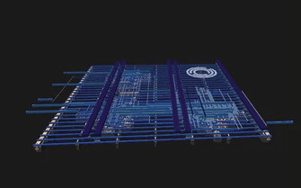
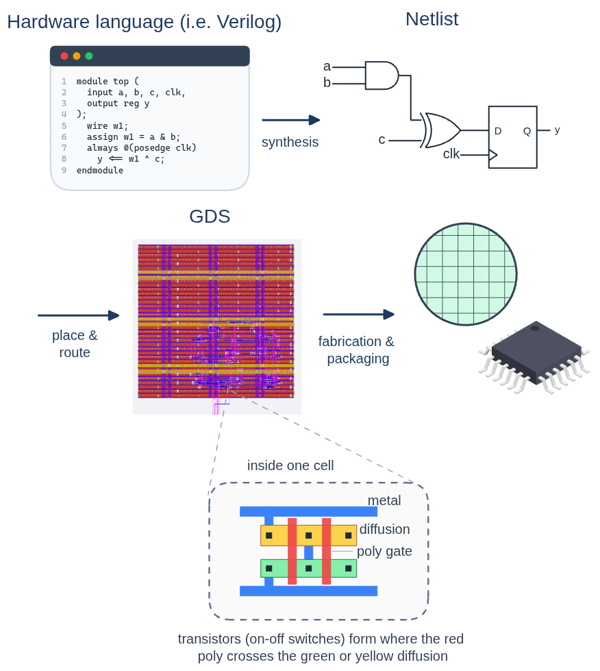

# Can you reverse engineer an ASIC?

**Source:** <https://blog.janestreet.com/can-you-reverse-engineer-an-asic/>
**Authors:** Anish Singhani, Benjamin Devlin
**Published:** Aug 05, 2026 (5 min read)
**Puzzle repo:** <https://github.com/janestreet/asic-puzzle-2026>
**Submissions close:** September 4th, 2026

> Archived locally on 2026-08-12 for offline reference; © Jane Street Group, LLC.
> Images are cached in [blog-assets/](blog-assets/).

---

Earlier this year we published a [puzzle](https://blog.janestreet.com/can-you-reverse-engineer-our-neural-network/) that handed you a complete neural network and asked you to figure out what it did. The response was great, so we’ve made another one! This time, we’re going much deeper down the tech stack.

For this puzzle we’ve designed a chip, but we’re only giving you the layout.

## A crash course in how chips get made

Modern chips start life as code. A hardware designer describes a circuit in a hardware description language like Verilog, which gets *synthesized* into a netlist of logic gates—NANDs, NORs, XORs, flip-flops. Then electronic design automation tools place and route those gates: they pick a physical location for every gate on the die and draw the metal wires that connect them, across many stacked routing layers connected by vias. The end result is a GDS file: a geometric description of every polygon on every layer of the chip, from the transistors that do the actual logic to all the metal on top of them. That’s the file a foundry such as Intel or TSMC uses to fabricate the physical silicon.

The GDS is, in a very real sense, the chip. Everything the circuit does is in there. The tricky part: nothing is labeled!

## The puzzle

> We’ve designed an ASIC, and we’re giving you its final mask: all of its metal, routing, and active transistor layers, along with some sample inputs and outputs.
>
> Your job is to reverse engineer it. First, recover a netlist from the layout. Then figure out the circuit’s true purpose. And then comes the puzzle within the puzzle: once you understand what the chip does, use it to tease out the output it’s looking for, and find the string value that’s your final answer.
>
> You can find everything you need [here](https://github.com/janestreet/asic-puzzle-2026).
>
> Some pointers for getting started:
>
> - The circuit is physically arranged to hint at its functionality, so look closely at the layout!
> - There is one section of the design that is used to generate the output but does not affect the `[success]` output. You can safely ignore it for the initial reverse-engineering steps.
> - You’ll need to come up with a way to simulate the underlying circuit to test your solution and get the final output!
> - You’ll know you have the correct solution when the `[success]` output signal goes high. Don’t forget to toggle `[rst_n]` before each input attempt.
> - We hid a few fun Easter eggs in the circuit and in the repository (including in parts you don’t need to look at to solve the main puzzle), see if you can spot them once you’re done with the puzzle.

Once you figure it out, submit your answer [here](https://docs.google.com/forms/d/e/1FAIpQLScNCnfZ1wC4HbARwynUZ25EKZyqJIzXM_5H5aHom-QeAhE6FA/viewform?usp=sharing&ouid=113383508758462277069) along with a brief description of how you did it. Submissions close on September 4th, 2026.

Feel free to collaborate with friends on the puzzle, but please refrain from posting spoilers (or a full writeup) online until the submissions are closed. If you do publish your solution (on a personal blog or repository) after submissions are closed, email us and we may include the link in our follow-up post!

Please don’t feed the puzzle files directly into an AI tool, nor use it to generate your writeups. Feel free to use AI for writing any scripts or code you may need as part of solving the puzzle, though! It’s also fair game to use AI to work through the warm-up puzzle, see below.

If you have questions as you go, please reach out to <asic-puzzle@janestreet.com> — we can’t give hints, but we’re happy to help otherwise.

We’ll feature the most interesting writeups and techniques in a follow-up post, and send swag for our favorite solutions.

## A warm-up

If you’ve never opened a GDS file before, don’t worry: most people haven’t either. To help you get started, we’re providing a small worked example: a simple binary adder, with its Verilog source, its gate-level netlist, and the resulting GDS. You can use it to get familiar with how a circuit maps onto a layout, and to test any tools you build before pointing them at the real puzzle.

The warm-up files are available in the [puzzle repository](https://github.com/janestreet/asic-puzzle-2026).

Everything you need is free and open source: the design uses an open-source PDK, and tools like [KLayout](https://www.klayout.de/) or [Magic VLSI](https://github.com/rtimothyedwards/magic) will happily open the GDS and let you poke around the layers.

## And a bigger challenge is coming

Consider this puzzle a warm-up of its own. Later this year we’ll be launching a competition where, instead of reverse engineering our chip, we’ll challenge you to design your own - and the most interesting entries will actually get fabricated, so you can test your chip in real life.

Stay tuned—we’ll announce the details here on the blog in the coming months.

## Hardware at Jane Street

The hardware team at Jane Street designs FPGAs and ASICs that run some of the fastest trading systems in the world, and the day-to-day work is full of puzzles just like this one: staring at a sea of gates, timing reports, or waveforms and slowly teasing out what’s really going on. These problems are hard in a way that’s deeply satisfying to solve, and honestly, it’s a big part of why we like working here.

If that sounds intriguing, some ways of learning more:

- Check out our hardware (FPGA and ASIC) [internships](https://www.janestreet.com/join-jane-street/position/8624440002/) and [full-time](https://www.janestreet.com/join-jane-street/position/8646893002/) roles.
- Read about [Hardcaml](https://hardcaml.org/) (our open-source OCaml hardware design libraries)
- On the academic side, read about our [visiting researcher](https://www.janestreet.com/join-jane-street/programs-and-events/visiting-researcher/) and [graduate fellowship](https://www.janestreet.com/join-jane-street/programs-and-events/graduate-research-fellowship/) programs.

If you just want to stay in touch, you can fill out [this form](https://bit.ly/4lEqiqb).

---

## Authors

| | |
|---|---|
|  | **Anish Singhani** |
|  | **Benjamin Devlin** |
