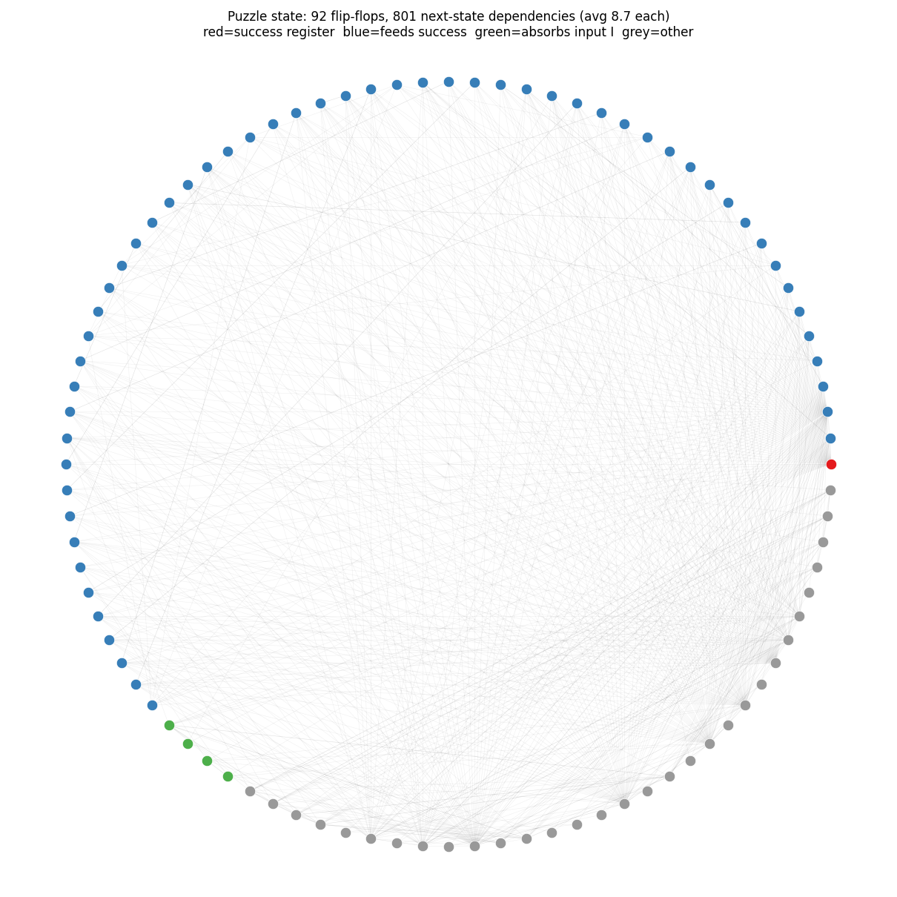

> **SUPERSEDED (2026-08-15).** The "hash lock" reading below was overturned: the accept check is
> 22 *independent* 2-bit counters + two flags — **the chip is a two-star Star Battle checker on an
> 11×11 grid**. See `../recon/opam/README.md` (or `../../recon/opam/README.md`) and `../SOLUTION.md`.
> This file is kept as history of how the analysis got there.

# The scrambled hash lock — mechanism analysis (task 2a)

What the puzzle chip *is*, as far as we've determined it from the netlist
(`../extract/puzzle/extracted_puzzle.v`), plus how to push the understanding further.

## Verdict (final — see "Purpose, verified" below for the proven form)

The chip is a **serial combination lock that reveals a hidden message**:

- The 122-bit input `I` is shifted in one bit per clock (while `enable=1`); a
  **122-state position counter** tracks which bit it is, and each bit is **absorbed
  into the 92-bit state by counter-addressed non-linear mixing**.
- `success` (flop `g__197`) fires **exactly once, on the cycle after bit 122**, when the
  state matches a **56-literal fingerprint (26 ones / 30 zeros)** that includes an
  **8-bit popcount checksum = 22**; it then latches. It is a pattern-match + hold,
  **not** a plain `state == constant`.
- The display sequencer prints one of **four messages** by `(success, popcount)`:
  `(* TWO STARS *)` on the key, `TRY AGAIN`, `EMPTY SKY` (all-zero), `BIG BANG` (all-one).
  (Answer + 122-bit key: see `../SOLUTION.md`.)

## The picture — why "scrambled"

The 92 flip-flops on a circle; each line is a next-state dependency ("flop A's next
value is computed from flop B's value"). Red = the `success` register, blue = feeds
`success`, green = absorbs input `I`, grey = output-generator only.

| metric | value | meaning |
|---|---|---|
| flip-flops (state bits) | 92 | |
| next-state dependency edges | **801** | |
| avg flops each flop depends on | **8.7** | a shift register would be ~1 |
| flops that absorb input `I` | 58 | input smeared widely |
| flops feeding `success` | 57 | the checked state |

Compare on the same circle: a **shift register** = a clean ring (no interior
lines); an **LFSR/CRC** = ring + a few chords; a **counter** = small tidy pattern;
**this** = a hairball. That dense diffusion (every input bit rapidly touching every
state bit) is the defining property of a hash — so the tangle *is* the mechanism,
not a failure to find one.

## HAL structural findings (`../hal_analysis/`)

- **DANA** register grouping: state is **fragmented** — largest groups 6-bit (×3),
  5-bit (×2), 38 singletons. No clean word-level registers.
- **solve_fsm**: **no isolable FSM/counter** — even the most self-contained group
  reads 6+ external flops; the smallest solves to a dense 8-state fragment, not a
  linear counter. (Needed a gate-library pin-type patch first: flop `D` was tagged
  `PinType.none`; patched `next_state`→`data` in the exported `.hgl`.)

Together: no recognizable sub-structure to read the purpose off of — obfuscated by
design. This is exactly why the **black-box solver route (BMC `cover(success)`) was
the way in**, not structural reading.

## How to actually understand it (the right method)

Do **not** read the dependency graph or trace gates — that's the obfuscation working
as intended (lowest-yield path). Instead extract the *function* by probing behavior,
which is clean no matter how ugly the gates are. Three answerable questions:

1. **Update rule — linear or non-linear?**  *(DONE → NON-LINEAR, see `linearity/`)*
   Feed single-bit input perturbations; check if state responses **XOR-superpose**.
   - Linear → it's an **LFSR/CRC/MISR** with a specific polynomial (nameable!); the
     whole tangle collapses to a matrix, and the key is solvable by Gaussian
     elimination.
   - Non-linear → a genuine **custom hash** ("no clean name" is then the honest answer).

2. **Accept condition / target constant.**  *(not yet run; `probe.ys` started it)*
   SAT on the `$4240` cone with the flops deleted (state → free inputs): count
   solutions. One → pure equality check; read the **57-bit target** straight out.
   (Exact analog of the warmup's "15 pairs summing to 496".)

3. **Reverse map (target → input).**
   Linear → solve the GF(2) linear system algebraically. Non-linear → search
   (the BMC `cover(success)` we already did → the 122-bit key).

The honest end-state for a hash lock: *"folds the 122-bit input into a 92-bit state
via a [linear-CRC-poly-P / non-linear] update; `success` fires when a 57-bit slice
== [constant]; key = [found]."* We already have the last clause; the gap is Q1 and Q2.

## Status

| item | state |
|---|---|
| it's a serial hash-lock (counter + addressed absorb + check + display) | ✅ established & **formally proven** (SAT miter, end-to-end sim, floorplan) |
| dependency graph / density | ✅ 92 FF, 801 edges, avg 8.7 |
| linearity test (Q1) | ✅ **NON-LINEAR** (30/30 trials; 51/92 bits non-linear) → custom one-way hash, not CRC/LFSR |
| target constant (Q2) | ✅ **read out** — 56 literals (26=1, 30=0) incl. popcount=22; check fires once after bit 122 then latches (`../recon/opam/README.md`) |
| reverse map / key (Q3) | ✅ done (BMC → 122-bit key, `../SOLUTION.md`) |

## Files here

- `puzzle.flop_dependency.png` / `.dot` — the state dependency hairball
- `fsm.py`, `fsm2.py`, `fsm3.py`, `fsm_dbg.py` — HAL DANA + solve_fsm scripts
- `fsm_best.dot`, `fsm_g7.dot`, `fsm_g8.dot` — solve_fsm transition graphs (small groups)
- `probe.ys`, `exposed.v` — started SAT accept-condition extraction (Q2)
- `run.log` — HAL run log

---

## Physical cross-check — predicted functional floorplan vs Jane Street's layout image

The blog says the chip is "physically arranged to hint at its functionality". We turned
that into a **falsifiable prediction**: take every gate's *real* placement from `puzzle.gds`
(via KLayout), color it by the functional block we derived **purely from netlist algebra**
(ANF → counter proof → cone analysis; zero placement information used), and compare with
Jane Street's rendered layout (`../../layout.png`).

- `floorplan_prediction_vs_actual.png` — our prediction (left) beside JS's image (right).
- `layout_annotated.png` — the same proven labels drawn directly on JS's image.

### Result: block-for-block agreement

| block (from algebra) | our cells actually sit… | JS image | match |
|---|---|---|---|
| **display / output generator** (251 gates) | tall right-hand column, x≈150–185 µm | the boxed "output generator" feeding `out[0..5]` | ✅ same shape & place |
| **accept check** (51 gates) | tight cluster top-right, x≈170–178, y≈270–285 | the small blob beside the `success` pin | ✅ |
| **absorb core** (362 gates) | tall central column + mid-left satellites + bottom-right block | central spine of blobs + peripheral blobs + blob near `out[6..7]` | ✅ incl. the sub-clusters |
| **position counter** (32 gates) | **two compact squares at the far LEFT**, x≈25–40, y≈100 & 150 | the two blobs at mid-left, beside the `enable`/`rst_n` pins | ✅ |

### A correction the prediction forced
By eye I had first labelled the tall central column as the *counter* ("shared logic goes to
the middle"). The placement data says otherwise: **the counter sits at the far left, hugging
the input pins, and the central column is the absorption core.** Physically this is the more
natural reading — the counter is the first consumer of `enable`/`I`, so the router puts it at
the input edge and fans it rightward into the absorber. `layout_annotated.png` was redrawn
with the proven labels; the earlier eyeballed version was wrong on this point.

### Why this matters (independent validation / anti-error-accumulation)
The two sides come from **independent sources**: cell *positions* from the raw GDS and cell
*labels* from our netlist algebra, vs Jane Street's physical rendering which was never used
in the derivation. Block placement, shape, and adjacency-to-the-correct-pins all agree. A
conversion error propagating through the gds → netlist → ANF chain would have had to
*coincidentally* reproduce the real silicon organisation. It matched instead. This is the
strongest external validation of the decomposition short of the designers' own source, and
it also physically confirms the ANF's finding that the 58 data bits form **sub-groups**
(the absorb satellites) rather than one undifferentiated mixer.

### Honest limits
- The µm→pixel overlay in `layout_annotated.png` uses a by-eye linear fit of the die frame
  (dots may be a few px off); the cluster↔blob correspondence is unambiguous regardless.
- The layout confirms **block structure and data flow**, not fine function (it cannot show
  the counter is 122-state or that the check latches) — for that we rely on the formal proofs.

---

## Purpose, verified (the final statement of what the chip is for)

**The chip is a serial combination lock that reveals a hidden message.** It accepts exactly
one 122-bit key, is one-way by construction, and prints a message that depends on its input.
*(Superseded: it is a Star Battle checker; there is no one-way function — see `../recon/opam/README.md`.)*

- **Counts the input bits** — a closed, non-linear, 122-state saturating position counter
  (9 flops, far-left of the die by the input pins); freezes after bit 122. Proven.
- **Fingerprints the input two ways** — (1) an 8-bit **popcount checksum** that must equal
  **22 = popcount(key)** (verified); (2) a **non-linear hash of the bit pattern** via
  counter-addressed high-degree mixing, required to land on **26 ones / 30 zeros** in
  specific state bits (read out literally).
- **Fires `success` exactly once**, the cycle after bit 122 (`g__180=1, g__243=0`), then
  latches via `success & (g__243 | ~g__180)`. Pattern-match + latch, not `==`.
- **Selects one of four messages** by `(success, popcount)`: `(* TWO STARS *)` / `TRY AGAIN` /
  `EMPTY SKY` / `BIG BANG`, via a separable display sequencer.

Verified independently by: formal SAT-miter proof (datapath), end-to-end sim ≡ netlist
(whole RTL, 0 mismatches), literal readout of the check, and the physical floorplan match.
**That is the purpose: validate a 122-bit secret and unlock a message.** It is not a named
algorithm — by design; the hash *is* the fingerprint. What remains "unknown" is only the
designers' story/theme (cosmology: empty sky → big bang → two stars), not chip behaviour.
